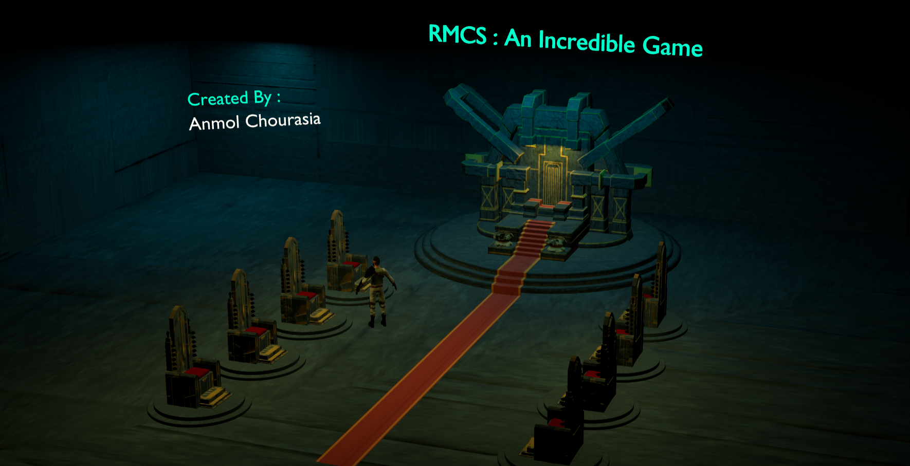

# Raja, Mantri, Chor, Sipahi: The Virtual Game  

Welcome to **Raja, Mantri, Chor, Sipahi**, a virtual adaptation of the classic Indian game! Immerse yourself in a 3D world created using **Three.js** and experience the thrill of guessing the "Chor" while facing the consequences of being wrong.  

---

## 🕹️ Game Concept  

The game revolves around four characters:  
1. **Raja**: The King, who observes the game.  
2. **Mantri**: The Minister, who plays a crucial role in assisting the Sipahi.  
3. **Chor**: The Thief, whose identity must remain hidden.  
4. **Sipahi**: The Soldier, whose mission is to correctly identify the Chor among the characters.  

- If the **Sipahi** guesses the Chor correctly, the game ends with celebration.  
- If the **Sipahi** guesses wrong, a dramatic animation unfolds where a **Killer** executes the Sipahi with a sword.  

---

## 🌟 Features  

- **Stunning 3D Environment**: Built using **Three.js**, the game features a highly interactive and visually appealing environment.  
- **Dynamic Characters**: Created and animated in **Blender**, each character has unique animations and appearances.  
- **Interactive Gameplay**: JavaScript logic drives the guessing mechanics, ensuring a smooth and engaging experience.  
- **Thrilling Endings**: Celebrate victory or face a dramatic defeat with custom animations.  

---

## 🛠️ Technologies Used  

- **Three.js**: For rendering the 3D environment and interactive elements.  
- **JavaScript**: To implement the game logic and interactions.  
- **Blender**: For designing and animating the 3D characters and assets.  
- **Vite**: Development setup for optimized building and live reloading.  

---

## 🚀 How to Play  

1. **Start the Game**: Begin by entering the virtual world.  
2. **Observe the Characters**: The Raja, Mantri, and Chor will take their positions.  
3. **Make Your Guess**: As the Sipahi, click on the character you suspect to be the Chor.  
4. **Outcome**:  
   - **Correct Guess**: Congratulations! You've identified the Chor successfully.  
   - **Wrong Guess**: Watch out! A Killer will appear and take you down with a sword.  

---

## 💻 Installation  

To play this game locally:  
1. Clone the repository:  
   ```bash
   git clone https://github.com/your-username/raja-mantri-chor-sipahi
   cd raja-mantri-chor-sipahi
## 🖼️ Preview  

Include screenshots or GIFs of the game to showcase the 3D environment and animations.  
For example:  
  
  

---

## 🙌 Acknowledgments  

Special thanks to the developers and designers who made this project possible.  
Inspiration drawn from the classic Indian game and modern 3D technologies.  

---

## 📜 License  

This project is licensed under the [lord_games](LICENSE).  

---

Get ready to relive the nostalgia of **Raja, Mantri, Chor, Sipahi** in a thrilling new dimension! Have fun! 🎮✨  
